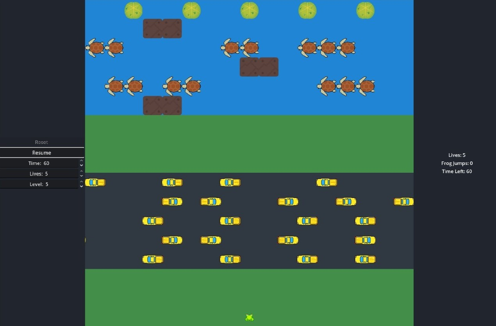
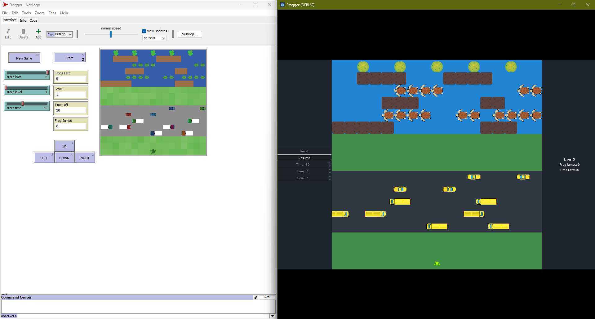

# Frogger in MARS

*Implementation of a NetLogo model in the MARS framework*

*Author: Yamam Al Shoufani*

*Date: August 2025*

This project implements the NetLogo model **“[Frogger](https://ccl.northwestern.edu/NetLogo/models/Frogger)”** in the **MARS** (Multi-Agent Research and Simulation) framework.

The goal is to replicate the game logic and agent interactions of the original model as closely as possible and to verify, through simulation runs and parameter variation, that both models produce comparable results under the same conditions.

The project was developed as part of the **Final Examination** in the elective module “K**I & Geoinformatik”** at **HAW Hamburg** (Summer 2025), supervised by **Prof. Dr. Thomas Clemen**.

---



---

## **Table of Contents**

1. [Project Overview](https://www.notion.so/Frogger-in-MARS-24c1bf2750c680118ddaf4f2371b1429?pvs=21)
2. [Model Design](https://www.notion.so/Frogger-in-MARS-24c1bf2750c680118ddaf4f2371b1429?pvs=21)
3. [Implementation Details](https://www.notion.so/Frogger-in-MARS-24c1bf2750c680118ddaf4f2371b1429?pvs=21)
4. [Simulation & Usage](https://www.notion.so/Frogger-in-MARS-24c1bf2750c680118ddaf4f2371b1429?pvs=21)
5. [Comparison with NetLogo Model](https://www.notion.so/Frogger-in-MARS-24c1bf2750c680118ddaf4f2371b1429?pvs=21)
6. [Conclusion](https://www.notion.so/Frogger-in-MARS-24c1bf2750c680118ddaf4f2371b1429?pvs=21)

---

## **1. Project Overview**

### Original NetLogo Model

The original **Frogger** model is part of the NetLogo Models Library. It is inspired by the classic arcade game “Frogger” and demonstrates basic agent-based interactions between a moving player agent (the frog) and other dynamic agents (cars, trucks, logs, turtles, pads) in a grid environment.

The goal of the frog is to reach safe zones at the top of the grid while avoiding obstacles and using moving platforms to cross hazardous areas.

You can find the NetLogo Frogger model website here: [https://ccl.northwestern.edu/NetLogo/models/Frogger](https://ccl.northwestern.edu/NetLogo/models/Frogger)

### Motivation for Selection

I chose the Frogger model for several reasons:

- **Clear agent interactions**: Multiple agent types with distinct behaviors and collision rules.
- **Dynamic environment**: Moving obstacles and platforms create varied simulation states.
- **Educational value**: Simple enough to implement within the MARS framework, yet complex enough to allow for meaningful parameter variation and model comparison.
- **Visual appeal**: The visual structure makes it easy to observe and evaluate simulation outcomes.
- **Gamification aspect**: The game-like setup makes the simulation more engaging and fun to work with, on top of its visual appeal.

### Objectives of the MARS Implementation

The main objectives in porting the model to MARS were:

1. Replicate the agent behaviors and environment of the NetLogo version.
2. Preserve the same initial conditions and adjustable parameters for comparison.
3. Implement a visual interface for real-time observation of the simulation.
4. Perform parameter variation to validate similarity between the two models.

---

## **2. Model Design**

### 2.1 Agents

The model consists of multiple agent types, each with distinct roles and movement patterns:

- **FrogAgent**
    - Represents the player-controlled frog.
    - Moves in four cardinal directions (up, down, left, right) in discrete steps.
    - Objective: reach one of the target pads at the top of the grid without colliding with hazards.
- **CarAgent**
    - Represents fast-moving obstacles on the road lanes.
    - Moves horizontally in a fixed direction with higher speed compared to trucks.
    - Causes immediate game over for the frog upon collision.
- **TruckAgent**
    - Represents slower, larger obstacles.
    - Moves horizontally in a fixed direction, covering more than one tile in length.
    - Also causes immediate game over for the frog upon collision.
- **LogAgent**
    - Moving platforms in the river section.
    - Moves horizontally and allows the frog to “ride” on them.
- **TurtleAgent**
    - Similar to logs, but with the ability to submerge temporarily.
- **PadAgent**
    - Static safe zones at the top of the grid.
    - The frog must occupy all pads to complete the level.
    - Each pad can only be occupied once per level.

### 2.2 Environment & Grid Layout

- **Grid-based world** with discrete tiles.
- Divided into multiple horizontal lanes:
    1. **Start zone** for the frog.
    2. **Road section** with cars and trucks.
    3. **River section** with logs and turtles.
    4. **Goal zone** with pads.
- Movement is turn-based, with each tick updating all agents’ positions.

### 2.3 Rules & Interactions

- **Collisions with vehicles** → Frog loses a life.
- **Falling into water** → Frog loses a life unless standing on a log/turtle.
- **Reaching a pad** → Frog is placed back at start for the next attempt, pad is marked as filled.
- **Game over** occurs when all lives are lost or when all pads are filled (win condition).

### **2.4 Parameters (MARS Implementation)**

The following parameters are configurable in my MARS Frogger simulation.

They are set either via **`config.json`** before the simulation starts or via the **Godot frontend UI** during runtime.

### **Simulation & Timing**

| Parameter | Source | Default | Description |
| --- | --- | --- | --- |
| `VisualizationTimeout` | `config.json` → MyGridLayer | 180 | Delay (in milliseconds) between checks for an ACK from the Godot client in `PostTick()`. Lower values check more frequently (lower latency), higher values check less often. |
| `TicksPerSecondDivisor` | `config.json` → MyGridLayer | 5 | Number of simulation ticks that equal one in-game second. |
| `steps` | `config.json` | 10000 | Total number of simulation ticks before stopping automatically. |

### **Levels & Layout**

| Parameter | Source | Default | Description |
| --- | --- | --- | --- |
| `LevelFilesCsv` | `config.json` → MyGridLayer | 5 CSV files listed | Semicolon-separated list of grid CSV files (levels). |
| Agent counts | `config.json` | Frog (1), Cars (22), Trucks (9), Logs (21), Turtles (17), Pads (5). | Number of agents of each type spawned at init |

### **Player Settings (UI adjustable)**

| Parameter | Source | Default | Description |
| --- | --- | --- | --- |
| `StartLives` | `DataVisualizationServer` UI | 5 | Number of lives the frog starts with. |
| `StartTimeSeconds` | `DataVisualizationServer` UI | 60 | Countdown time per life before automatic death. |
| `StartLevel` | `DataVisualizationServer` UI | 1 | Level index to start from (1-based). |

### **Agent Movement (fixed in code)**

| Agent | Speed Behavior |
| --- | --- |
| **CarAgent** | Moves **1 tile every tick** in heading direction. Wraps at edges. |
| **TruckAgent** | Moves **1 tile every second tick** in heading direction. Wraps at edges. |
| **LogAgent** | Moves **1 tile every second tick** to the right. Wraps at edges. |
| **TurtleAgent** | Moves **1 tile every second tick** to the left. Can be hidden (submerged |

---

## **3. Implementation Details**

### 3.1 Technology Stack

- **MARS Framework**: Multi-Agent Research and Simulation framework used to implement the model in C#.
- **.NET**: Core runtime for running the simulation logic.
- **Godot Engine**: Used as a visualization frontend, connected via WebSocket.
- **NetLogo**: Original reference implementation for comparison and validation.

### 3.2 Code Structure

The MARS implementation follows a modular agent-based structure:

- **Agents**
    - `FrogAgent`: Player-controlled entity, processes input from the frontend.
    - `CarAgent`, `TruckAgent`: Road obstacles with different speeds.
    - `LogAgent`, `TurtleAgent`: Moving platforms in the river section.
    - `PadAgent`: Static goal slots.
    - All inherit from `AbstractFroggerAgent`, which provides common properties like position, heading, and breed type.
- **Layer**
    - `MyGridLayer`: Core simulation layer hosting the environment and all agents. Handles:
        - Loading level layouts from `.csv` files.
        - Managing game rules (collision detection, drowning, pad completion, win/loss conditions).
        - Time management and lives tracking.
        - Providing simulation state to the internal `DataVisualizationServer`
- **Frontend Communication**
    - `DataVisualizationServer`: WebSocket bridge between the MARS simulation and the Godot client.
        - Sends agent state each tick.
        - Receives input commands (`up`, `down`, `left`, `right`).
        - Handles control commands (`start`, `pause`, `resume`, `restart`, parameter changes).

### 3.3 Data & Configuration

- **`config.json`**
    - Defines global simulation settings (number of steps, output format).
    - Configures layer parameters (`VisualizationTimeout`, `TicksPerSecondDivisor`, `LevelFilesCsv`).
    - Specifies agent counts for each type.
- **Level CSV Files (`levelXGrid.csv`)**
    - Contain the tile-based layout of each level.
    - Encoded with numeric tokens (1 = frog start, 2/3 = trucks, 4/5 = cars, 6 = logs, 7 = turtles, 8 = pads).
    - Loaded and parsed by `MyGridLayer` into agent spawn positions.
- **Runtime Parameters (via Godot UI)**
    - `StartLives`, `StartTimeSeconds`, and `StartLevel` can be set interactively before a run.

### 3.4 Key Implementation Differences from NetLogo

- **Time base & pacing**
    
    NetLogo advances agents with `every 0.1` and per-agent `speed/time` counters; my MARS version maps ticks to seconds via `TicksPerSecondDivisor` and decrements time on that cadence. Each tick is also gated by a WebSocket ACK, with a polling delay controlled by `VisualizationTimeout`.
    
- **Frontend & control path**
    
    NetLogo uses its built-in UI; my simulation is headless and communicates with a Godot client via a C# WebSocket bridge (`DataVisualizationServer`) supporting `start/pause/resume/restart` and live setters for `StartLives`, `StartTimeSeconds`, and `StartLevel`.
    
- **Level handling**
    
    NetLogo advances levels internally; in MARS I load grid layouts from CSV (`LevelFilesCsv`), apply the chosen `StartLevel` at (re)start, and end the game when all pads are filled (no auto-advance).
    
- **Agent movement rates (fixed vs. parametric)**
    
    NetLogo vehicles/platforms use a `speed` variable with timers. In MARS the movement cadence is fixed in code: cars move every tick, trucks every second tick, logs and turtles every 2 ticks (right/left, respectively).
    
- **Turtle diving**
    
    NetLogo includes random dive behavior; in MARS I expose a `Hidden` flag on turtles but do not yet implement a dive schedule/randomizer—hidden status only matters if set.
    
- **Platform carrying logic**
    
    NetLogo moves the frog immediately in the same update that moves logs/turtles. In MARS, time is discrete and paced by `TicksPerSecondDivisor` plus a WebSocket ACK from the client, so I avoid same-tick moves to prevent race conditions. Instead, I snapshot platform positions at T−1, compute per-row motion (wrap-aware, clamped to ±1), and carry the frog only if it was on a platform in that row at T−1. This ensures deterministic, one-move-per-tick behavior even with network pacing. In rare edge cases this can cause slight “push-back” of the frog, but it proved the most stable and consistent approach for my setup.
    
- **Water detection**
    
    NetLogo derives water from patch colors; MARS treats rows `Y ∈ [0..6]` as water and checks absence of pads/logs/visible turtles on that tile.
    
- **Frog population**
    
    The NetLogo model spawns multiple “sensor frogs” (`frogs2..9`). The MARS model uses a single active `FrogAgent`.
    

---

## **4. Simulation & Usage**

### 4.1 Requirements

- **.NET 8.0 SDK** - for running the MARS simulation.
- **MARS Framework** - installed as per MARS documentation.
- **Git** - to clone the repository.
- **No Godot installation required** — the visualization frontend is included as a packaged executable in `Visualization\Frogger.exe`

### 4.2 Installation

1. **Clone the repository**
    
    ```bash
    git clone <repo-url>
    cd frogger_mars
    ```
    
2. **Install dependencies**
    
    Ensure the MARS framework is available in your development environment.
    
    If using Rider or Visual Studio, restore NuGet packages.
    

### 4.3 Running the Simulation

1. **Start the MARS simulation**
    - From the project root, run:
        
        ```bash
        dotnet run
        ```
        
    - MARS will initialize agents and start the WebSocket server on `ws://127.0.0.1:8181`.
2. **Start the Visualization**
    - Run the included executable:
        
        ```
        Visualization\Frogger.exe
        ```
        
    - This launches the visualization frontend and connects to the running MARS simulation.
3. **Start the game**
    - Once both are running, click **Start** in the visualization window to begin the simulation.

### 4.4 Controls (Visualization Frontend)

- **Arrow keys** — Move the frog up/down/left/right (one tile per tick).
- **Pause / Resume** — Temporarily halt or continue the simulation.
- **Restart** — Reset lives, time, and level to initial values.
- **UI Parameters** (adjust before starting):
    - **Start Lives** — Number of lives for the frog.
    - **Start Time** — Time (in seconds) per life.
    - **Start Level** — Which level to load first.

---

## **5. Comparison with NetLogo Model**

### **5.1 Comparison Methodology**

To verify that my MARS implementation behaves similarly to the original NetLogo *Frogger* model, I performed side-by-side simulation runs under matched conditions.

### **Stages of Comparison**

1. **Stage 1 – Stationary baseline & parameter variation**
    - I kept the frog at its start position with no input.
    - Purpose: Validate that hazard and platform movement patterns, as well as the countdown timer, match between MARS and NetLogo without player influence.
    - Parameter variation in this stage:
        - `StartTimeSeconds` (e.g., 30, 60, 90)
        - `StartLevel` (tested with multiple level numbers)
    - For each variation, I recorded:
        - Time until the level timer expired
        - Movement patterns of cars, trucks, logs, and turtles
        - Correct level layout and agent positions at the start of the simulation
    - These results were compared directly with NetLogo runs under identical settings.
2. **Stage 2 – Controlled movement & parameter variation**
    - I used consistent manual movement patterns to reach specific tiles.
    - Purpose: Test interaction mechanics in a reproducible way, including:
        - Logs and turtles carrying the frog
        - Collision detection with cars and trucks
        - Drowning behavior when in water without a platform
        - Pad completion and win condition logic
    - Parameter variation in this stage:
        - `StartLives` (e.g., 3, 5, 7)
        - `StartLevel` (tested with multiple level numbers)
    - For each variation, I confirmed:
        - Correct decrement of lives on death
        - Trigger of game-over when lives reach zero
        - Correct level layout and agent positions after start
3. **Stage 3 – Free play**
    - I moved the frog freely toward pads as in normal gameplay.
    - Purpose: Compare overall “feel” and difficulty progression between the two versions.

---

### **Test Conditions**

- **Same level layouts**: All levels from the NetLogo model were replicated in the MARS implementation.
- **Same initial conditions**: Starting lives, starting time, and level selection were aligned (`StartLives`, `StartTimeSeconds`, `StartLevel`).
- **Same obstacle and platform counts**: Agent counts for cars, trucks, logs, turtles, and pads were matched between the two models.

### **Metrics Collected**

- Time until the level timer expired in stationary mode.
- Movement patterns of vehicles and platforms.
- Correct level loading and agent placement for different `StartLevel` values.
- Success/failure rates for controlled crossing attempts.
- Correct behavior of lives counter and game-over condition.

Special attention was given to differences in **time handling**:

- NetLogo uses continuous timing (`every 0.1`) with per-agent speed counters.
- MARS uses discrete ticks, mapped to seconds with `TicksPerSecondDivisor` and synchronized with a WebSocket ACK cycle.

These differences meant I focused on **pattern consistency** and outcome similarity rather than expecting identical tick counts in every movement cycle.

---

## **5.2 Results**

### **Stage 1 – Stationary baseline & parameter variation**

| StartTimeSeconds | StartLevel | Model | Time Until Timeout (s) | Car/Truck Pattern Match? | Log/Turtle Pattern Match? | Correct Level Layout? | Notes |
| --- | --- | --- | --- | --- | --- | --- | --- |
| 30 | 1 | MARS | 140 s 
= 28 s per live
→ 1 Game sec = 0,93 s | Yes | Yes | Yes | Trucks are slightly shifted due to differences in size. |
|  |  | NetLogo | 31 s per live
→ 1 Game sec = 1,03 s | Yes | Yes | Yes | After the first timeout, a pop-up appears indicating that the first frog has died. |
| 60 | 3 | MARS | 56 s per live | Yes | Yes | Yes | - |
|  |  | NetLogo | 62 s per live | Yes | Yes | Yes | Trucks in NetLogo move slightly slower than in the MARS simulation. |



---

### **Stage 2 – Controlled movement & parameter variation**

| StartLives | StartLevel | Model | Lives Decrement  and start lives parameter Work? | Game Over at 0 Lives? | Collision Works? | Drowning Works? | Log/Turtle Carry Works? | Pad Completion Works? | Correct Level Layout? | Notes |
| --- | --- | --- | --- | --- | --- | --- | --- | --- | --- | --- |
| 3 | 1 | MARS | Yes | Yes | Yes | Yes | Yes* | Yes | Yes | In some edge cases, the frog gets pushed back while being carried. |
|  |  | NetLogo | Yes | Yes | Yes | Yes | Yes* | Yes | Yes | In some edge cases, the frog gets pushed forward while being carried, but this happens less often than in MARS. |
| 5 | 2 | MARS | Yes | Yes | Yes | Yes | Yes* | Yes | Yes |  |
|  |  | NetLogo | Yes | Yes | Yes | Yes | Yes* | Yes | Yes |  |

---

### **Stage 3 – Free play**

| Metric | Model | Value | Notes |
| --- | --- | --- | --- |
| Average Jumps per Life | MARS | 15 | - |
|  | NetLogo | 20 | - |
| Average Lives Lost per Level | MARS | 4 | - |
|  | NetLogo | 3 | - |
| Time to Complete Level 1 | MARS | 250 s | - |
|  | NetLogo | 215 s | - |
| Time to Complete or lose Level 5 | MARS | 45 s (Game over) | 5 lives |
|  | NetLogo | 52 s (Game over) | 5 lives |

---

## **5.3 Observations**

- **Overall similarity**:
    - Hazard movement patterns for cars, trucks, logs, and turtles are consistent between the two models.
    - Time behavior relative to the in-game second is close: MARS averages ~0.93 s per game second, NetLogo ~1.03 s, with both scaling proportionally to the configured `StartTimeSeconds`.
    - Levels load with correct layouts and agent positions across all tested `StartLevel` values.
    - Pad completion, drowning, and collision rules behave identically in normal cases.
- **Key matches**:
    - Grid layout and agent placement match across all tested levels.
    - Collision logic with cars, trucks, water, and pads is consistent.
    - Lives decrement correctly on death, and the `StartLives` parameter functions as expected.
    - Game-over triggers reliably when lives reach zero.
    - Pad completion logic works identically, ending the game or progressing as intended.
    - Vehicle and platform patterns maintain relative positions except for known differences in truck speed/size.
- **Notable differences**:
    - Platform carry logic shows slight divergence in edge cases:
        - In MARS, the frog can occasionally be pushed back when carried.
        - In NetLogo, the frog can sometimes be pushed forward, but this happens less often than in MARS.
    - Truck speed in NetLogo appears slightly slower, and truck size differences cause a minor positional offset compared to MARS.
    - NetLogo displays a pop-up notification after the first timeout, whereas MARS continues without interruption.
- **Impact on gameplay**:
    - The carry-logic edge cases make the MARS simulation marginally harder in certain crossing situations, but not in a major way.
    - Slight truck speed differences may affect timing in tight lanes, but hazard avoidance strategies remain essentially the same.
    - Absence of the NetLogo pop-up after the first timeout in MARS results in smoother, uninterrupted play.

## **6. Conclusion**

The comparative analysis between the MARS-based *Frogger* simulation and the original NetLogo model shows that the two implementations are **functionally and behaviorally similar** to a degree that meets the project’s requirements.

Across all test stages (stationary baseline, controlled movement, and free play) the following observations hold:

- **Core mechanics** such as hazard movement patterns, collision detection, drowning, pad completion, life decrement, and level progression are consistent between the two models.
- **Timing behavior** is closely aligned, with only minor differences in the real-world duration of in-game seconds, which do not significantly impact gameplay.
- **Level layouts** are faithfully replicated, and agent counts and starting positions match the NetLogo implementation.

Some differences were identified:

- **Platform carry logic** behaves slightly differently in edge cases, sometimes pushing the frog backward in MARS or forward in NetLogo.
- **Truck speed and size** differ slightly, leading to small positional offsets.
- **User interface flow** differs, with NetLogo showing a pop-up after the first timeout, while MARS continues without interruption.

These deviations have **minimal impact on the overall gameplay experience**. In fact, the game’s difficulty, pacing, and player strategies remain largely unaffected, and the MARS implementation is sufficiently faithful for the purpose of simulation comparison.

Overall, the MARS version successfully replicates the essential behaviors of the NetLogo *Frogger* model while adapting them to the tick-based architecture of the MARS framework.

## Credits

- Original NetLogo model by Mochamad Agung Tarecha (UIN Maulana Malik Ibrahim Malang, Indonesia).
- similar MARS implementation by the MARS Group HAW especially the [LaserTag](https://github.com/MARS-Group-HAW/model-mars-laser-tag-game/tree/master) implementation
- Various art assets by different creators — see full credits in `\Visualization\License.txt`.